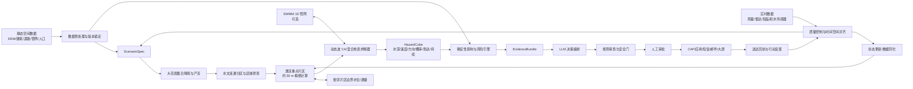

# RainFall 方法框架（审阅草案）

版本：v0.2，2026-07-27

> 2026-08-10 实现补充：仓库现已包含 `src/rainfall_ca/` 下可运行的合成山区局部惯性 CA 原型、GPU/CPU 双后端和交互网页。该原型用于代码验证、教学演示和后续基准搭建，不表示本框架中的正式主求解器、真实数据接入、分区耦合或业务验证已经完成。详见 [RainCell GPU 技术与使用报告](RainCell_GPU_技术与使用报告.md)。

## 1. 研究目标与可检验命题

### 1.1 总体目标

构建一个可滚动更新的城市暴雨洪涝系统：统一接收大范围降雨观测/预报，按照地表与排水系统的水文连通关系组织计算域，以区域级快速筛查激活重点片区，并在重点片区快速输出约 30 m 网格的水深、二维速度和主导方向、概率淹没结果、对象级影响、可执行处置建议和可审计推送消息。

### 1.2 核心研究问题

- RQ1：在目标区域和目标分辨率下，时序 CA 能否以显著低于预报窗口的时间完成模拟，同时保持可接受的水深、范围和到达时间误差？
- RQ2：加入管网交换、实时观测更新和集合降雨后，是否改善概率预报的校准度和关键点预警提前量？
- RQ3：与单 LLM 或纯模板相比，证据约束的多角色决策链是否提高方案可执行率、数值一致性和消息时效，同时不增加危险建议？
- RQ4：以水文连通关系进行分区并交换守恒边界通量后，分区计算能否在无接缝伪影和不可接受质量误差的条件下复现整体模型的水深、速度、方向与到达时间？

这些是待实验验证的命题，不是现有结论。

## 2. 总体架构



任何一条外发消息都必须能反查到 `ScenarioSpec → SimulationRun → HazardCube → RiskAssessment → EvidenceBundle → AlertMessage`。

### 2.1 三类空间范围

RainFall 明确区分三个不能混用的空间对象：

1. **降雨输入域**：覆盖强降雨系统及其时空演变，用于接收雷达 QPE、雨量站和短临 QPF。它可以远大于单个城市重点片区。
2. **结果关注区（Area of Interest, AOI）**：需要输出逐网格风险的重点区域。第一阶段以约 $1\ \mathrm{km^2}$、30 m 基础网格的城市片区作为建议对象。
3. **水动力计算域**：覆盖 AOI 的地表上游贡献区、可能向 AOI 溢流的洼地、必要的下游开放边界以及与 AOI 连通的排水管网。计算域由水文连通性决定，不能直接等同于 AOI 的矩形裁剪范围。

30 m 是基于现有 DEM 的 MVP 计算分辨率，不等于已经证明具有 30 m 的现实预测精度。一个 30 m 单元可能同时包含道路、建筑、绿地、路缘和雨水口；水深可解释为单元尺度状态，速度与方向必须通过独立验证后才可用于道路通行、人员安全或结构冲击判断。

### 2.2 水文连通分区

分区优先遵循水流拓扑而不是行政区、规则瓦片或降雨图斑。预处理至少包括：

- 对 DEM/DSM 做洼地、桥面、建筑、道路、河渠和出水口的用途相关修正；
- 计算地表流向、汇流累积、子汇水区、洼地容积和溢流高程；
- 将雨水口、检查井、管道、泵站和排口表示为 1D 排水图；
- 建立地表分区邻接图、管网连接图及二者之间的交换节点；
- 识别地下管网跨越地表分水岭、上游区域外来水和边界倒灌等连接；
- 为每个分区锁定几何版本、上游集合、下游集合、交换边和边界类型。

降雨范围决定水的输入位置，地形、城市结构和排水网络共同决定水的迁移路径。仅凭 30 m DEM 自动提取的自然汇水区只能作为初始拓扑，不应未经城市要素和管网校正就直接用于业务计算。

### 2.3 分层计算与动态激活

建议采用“区域筛查—重点片区精算—关键位置局部加密”的分层策略：

1. 区域层在完整降雨输入域内计算空间降雨、入渗、初损、子汇水区产流、汇流时间和排水能力余量；
2. 根据产流量、历史易涝点、边界来水、管网超载概率和关键设施暴露激活高风险水文连通片区；
3. 激活片区使用动态波 CA 或经验证的混合求解器，原生计算 $h,q_x,q_y$；
4. 相邻片区持续交换边界水位和通量，管网节点持续交换入流、排水与反涌流量；
5. 道路下穿、地铁口、医院等关键位置在具备高质量地形时再评估 5–10 m 局部加密或亚网格参数化；
6. 降雨和观测更新后，只重算受影响的上游—下游连通子图，同时保存未激活区域的保守状态。

区域层不负责伪造 30 m 的局地速度细节；精细层也不能脱离区域层提供的上游来水和边界状态独立运行。

### 2.4 片区边界与守恒耦合

对相邻片区 $A$ 与 $B$，边界交换量表示为随时间变化的通量或流量过程：

$$
Q_{A\rightarrow B}(t)
=\sum_{e\in\Gamma_{AB}}
h_e(t)\,[\vec v_e(t)\cdot\vec n_{AB}]\,\Delta l_e
+Q_{\mathrm{sewer},A\rightarrow B}(t)
$$

同一交换量在 $A$ 中记为流出、在 $B$ 中记为流入。实现必须满足：

- 片区交界处使用共享边界状态或带 halo 的同步更新；
- 上游流出、下游流入和管网交换使用同一份带符号通量记录；
- 开放边界、封闭边界、规定水位和规定流量边界分别记账；
- 洼地达到溢流高程后允许连接关系随状态激活；
- 不重复施加降雨、入渗、排水或边界来水；
- 全域质量平衡由各片区源汇、边界通量和存储量统一汇总。

第一版不要求立即实现任意规模的分布式异步求解，但数据结构和运行记录必须预留 `partition_id、upstream_ids、downstream_ids、boundary_flux_id、drainage_graph_version` 等字段。

### 2.5 分区方案的专项验证

分区计算必须通过“整体模型—分区模型”配对验证。在一个能够整体求解的小型区域上，使用完全相同的 DEM、降雨、参数、时间步和边界，分别运行整体模型与分区耦合模型，比较：

- 每个片区及全域的质量闭合误差；
- 交界两侧水位、法向通量和流向符号；
- 水深、$u/v$、速度模长、方向和到达时间；
- 分区接缝附近的误差是否显著高于内部区域；
- 不同分区尺度、halo 宽度和同步频率的敏感性；
- 激活/休眠切换是否丢失状态或重复计水。

只有分区误差低于预注册容差，且没有系统性接缝伪影时，才能把分区加速用于正式滚动预测。

## 3. 数据层

### 3.1 静态数据

| 数据 | 最低用途 | 质量检查 |
|---|---|---|
| DEM/DSM | 地表高程、流向、汇流累积与水文连通分区 | 坐标系、分辨率、垂直误差、空洞、异常台阶、水文修正版本 |
| 建筑轮廓 | 阻水与暴露对象 | 拓扑、自交、与 DEM 对齐 |
| 道路/下穿通道 | 风险对象与关键流路 | 高程、道路等级、低洼点 |
| 土地覆盖/不透水率 | 入渗、糙率、产流 | 分类时间、分辨率、缺失 |
| 排水管网/雨水口 | 排水能力与地表交换 | 管径、底高程、连接、泵站状态 |
| 河道/边界/出水口 | 开放或控制边界 | 边界类型与水位时序 |
| 人口与脆弱群体 | 暴露和脆弱性 | 时段人口、隐私聚合 |
| 关键设施 | 医院、学校、变电站、避难点 | 坐标、能力、可用状态 |

### 3.2 动态数据

- 雨量站观测；
- 覆盖完整降雨输入域的雷达 QPE；
- 0–3 小时雷达外推或数值天气 QPF；
- 积水点水深、井盖/管网水位和泵站状态；
- 道路封闭、交通速度、众包照片（只作带质量等级的辅助证据）；
- 上游水位或边界流量（若后续扩展河道影响）。

### 3.3 数据质量门

每条动态数据必须带：

`source_id、observed_at、received_at、crs、unit、quality_flag、coverage、checksum/version`

进入仿真前执行：

1. 单位和坐标系校验；
2. 时间新鲜度与未来时间检查；
3. 空间覆盖和缺测检查；
4. 物理范围与突变检查；
5. 多源降雨偏差检查；
6. 失败时采用最近可信数据、保守情景或停止外发，并明确标记降级。

## 4. CA 数值引擎

### 4.1 元胞状态

对格点 $i$ 在时刻 $t$ 定义：

$$
S_i^t = \{z_i,\ h_i^t,\ q_{x,i}^t,\ q_{y,i}^t,\ u_i^t,\ v_i^t,\ H_i^t,\ n_i,\ \phi_i,\ r_i^t,\ f_i^t,\ d_i^t,\ b_i,\ q_{sewer,i}^t\}
$$

其中：

- $z_i$：地面高程；
- $h_i^t$：水深；
- $q_{x,i}^t,q_{y,i}^t$：两个坐标方向的单宽流量；
- $u_i^t=q_{x,i}^t/h_i^t,\ v_i^t=q_{y,i}^t/h_i^t$：深度平均速度分量；
- $H_i^t=z_i+h_i^t$：水面高程；
- $n_i$：等效糙率；
- $\phi_i$：不透水率或土壤类型；
- $r_i^t$：降雨强度；
- $f_i^t$：入渗损失；
- $d_i^t$：简化排水损失；
- $b_i$：建筑/堤墙/开放边界等类型；
- $q_{sewer,i}^t$：与 1D 管网交换流量。

### 4.2 水量更新

采用局部质量平衡：

$$
h_i^{t+\Delta t}
= h_i^t
+ \Delta t(r_i^t-f_i^t-d_i^t)
+ \frac{\Delta t}{A_i}
\left(
\sum_{j\in N_i} q_{j\rightarrow i}^t
- \sum_{j\in N_i} q_{i\rightarrow j}^t
+ q_{sewer,i}^t
\right)
$$

主求解器不再只依据邻域水面高程差“摊水”。优先评估动态波 CA（SWFCA）或 CA—有限体积混合方法，使质量与惯性共同参与局部转移；水深、$q_x$、$q_y$ 是原生状态，速度模长与方向由它们派生：

$$
s_i=\sqrt{u_i^2+v_i^2}, \qquad
\theta_i=\operatorname{atan2}(v_i,u_i)
$$

当 $h<h_{\min}$ 或 $s<s_{\min}$ 时，方向应标记为无效而不是输出随机角度。求解器必须满足：

- 非负水深；
- 局部转移不超过可用水量；
- 同步更新或守恒的冲突消解；
- 明确定义开放边界、封闭边界和结构物；
- 对源、汇、边界和数值截断分别记账。
- 静水状态速度为零且不产生伪流；
- 在斜向流、汇流、分流和建筑绕流中不过度锁定到栅格轴向；
- 速度和方向来自守恒通量，而非仅对水深图做事后坡度估计。

WCA2D 保留为快速对照，CA-ffé 保留为最终淹没范围筛查。具体动态波转移公式将在精读 SWFCA 和混合 CA 文献、完成基准复现后锁定，本草案不伪造一个“看似完整”的动量公式。

### 4.3 时间推进

- 主求解器保留真实时间轴；
- 根据最大局部转移能力采用稳定的固定或自适应 $\Delta t$；
- 输出固定业务时间间隔的快照，例如每 1–5 分钟；
- 干湿单元使用阈值和迟滞，避免数值抖动；
- 对极端陡坡、高动量流、狭窄通道标注 CA 适用性风险。

### 4.4 降雨、入渗与排水

建议实施顺序：

1. 空间可变降雨直接落在格点；
2. 常量/土地类型相关入渗；
3. 简化格点排水能力；
4. Green-Ampt 等更物理的入渗；
5. 与 SWMM 检查井/雨水口双向交换。

简化排水模式下也要限制累计排水量和排水能力，避免无条件“抽走”地表水。

### 4.5 1D/2D 耦合

每个交换节点计算地表水位与管网节点水头差：

- 地表高、管网有容量：地表水进入管网；
- 管网超压：检查井溢流返回地表；
- 交换流量受井口面积、堰/孔口关系、可用水量和时间步限制；
- 地表与管网两侧使用同一交换量，保证耦合质量守恒。

### 4.6 并行实现

先实现可解释的 CPU 参考版本，再做 GPU：

- Structure of Arrays 连续内存；
- 双缓冲读写；
- 静态图层常驻设备；
- 活跃湿单元列表或分块；
- 以水文连通子图激活计算片区，并为分区边界保留 halo/共享通量缓冲；
- 并行规约计算质量平衡和最大变化；
- 确定性模式用于回归测试；
- CPU/GPU 同输入逐步对比。

不建议一开始就只保留 GPU 实现，否则难以区分物理错误、并行竞争和浮点差异。

## 5. 实时集合预测与状态更新

### 5.1 集合来源

对降雨、初始水深、入渗、排水能力和关键边界进行扰动，形成 $K$ 个成员：

$$
\mathcal{E}=\{S^{(1)},S^{(2)},\ldots,S^{(K)}\}
$$

成员不应仅靠随机噪声生成，优先使用：

- 多个短临/数值预报成员；
- 雷达—雨量不同偏差订正方案；
- 排水正常、部分堵塞、泵站故障等离散工况；
- 经历史校准的参数分布。

### 5.2 滚动更新

建议每轮：

1. 接收新观测；
2. 完成质量控制和偏差订正；
3. 更新当前地表/管网状态；
4. 从更新时刻向未来 0–3 小时重跑或续跑集合；
5. 与上一轮结果比较，记录风险升级、降级与空间迁移。

初期可用观测点的局部水深纠偏；数据充分后再评估 EnKF/粒子滤波。数据同化方法必须通过“无同化”对照证明价值。

## 6. 灾害风险与影响评估

### 6.1 不使用单一加权分数掩盖硬风险

评估顺序：

1. **硬触发**：例如关键设施进水、生命安全阈值、唯一疏散路被淹、模型/数据失效；
2. **危害**：水深、流速或流量代理、到达时间、持续时间、上升速率和概率；
3. **暴露**：人口、建筑、道路、车辆、关键设施；
4. **脆弱性**：人群、建筑首层、设施耐受、昼夜差异；
5. **后果**：受影响人数、道路中断、设施服务损失和预期损失区间；
6. **置信度**：集合一致性、观测支持、数据新鲜度、适用边界。

### 6.2 对象级输出

每个对象至少输出：

```json
{
  "asset_id": "road_segment_001",
  "asset_type": "road",
  "forecast_window": ["2026-07-27T14:00:00+08:00", "2026-07-27T17:00:00+08:00"],
  "max_depth_p50_m": 0.0,
  "max_depth_p90_m": 0.0,
  "arrival_time_p50": null,
  "duration_above_threshold_min": 0,
  "exceedance_probability": 0.0,
  "risk_level": "pending_rules",
  "confidence": "pending",
  "evidence_refs": []
}
```

示例中的数值是占位符，不是预测结果。

### 6.3 风险规则治理

- 规则放在版本化配置中，不写死在提示词；
- 每种对象有独立阈值和行动映射；
- 规则变更需专家审批和回放测试；
- 模型概率、风险等级和官方预警等级分字段保存；
- 支持 `draft / internal / official` 三种发布状态。

## 7. LLM 决策系统

### 7.1 角色分工

| 角色 | 允许做 | 不允许做 |
|---|---|---|
| 事件编排器 | 读取 ScenarioSpec、选择白名单工具、组织流程 | 修改原始观测 |
| 仿真分析员 | 汇总运行状态、比较集合和历史轮次 | 自行填造数值 |
| 风险解释员 | 把结构化风险翻译成对象级影响 | 改写风险等级 |
| 处置规划员 | 从预案库检索并草拟行动、资源和责任主体 | 绕过权限或硬约束 |
| 消息生成器 | 按受众和渠道生成短消息/报告 | 私自扩大范围或时效 |
| 安全审查员 | 检查证据、矛盾、缺失、敏感信息和措辞 | 代替人工签发 |

第一版也可在一个 LLM 中实现这些逻辑角色，但必须保留独立输入输出和审查步骤，以便做消融实验。

### 7.2 共享结构化对象

- `ScenarioSpec`：区域、时间、数据版本、降雨成员、模型配置；
- `SimulationRun`：运行 ID、代码版本、硬件、日志、质量平衡、状态；
- `HazardCube`：时空水深、概率、到达时间、持续时间；
- `RiskAssessment`：对象级危害、暴露、脆弱性、后果和置信度；
- `EvidenceBundle`：允许 LLM 引用的事实、来源和限制；
- `DecisionPlan`：行动、依据、责任主体、开始/结束条件、替代方案；
- `AlertMessage`：受众、区域、等级、确定性、正文、行动指引和审批。

### 7.3 EvidenceBundle 最低要求

```json
{
  "event_id": "string",
  "analysis_time": "ISO-8601",
  "data_cutoff": "ISO-8601",
  "scenario_version": "string",
  "simulation_run_ids": ["string"],
  "observations": [],
  "forecast_summary": {},
  "affected_assets": [],
  "uncertainty": {},
  "model_limitations": [],
  "allowed_claims": [],
  "forbidden_claims": [],
  "evidence_hash": "sha256"
}
```

LLM 输出中的每个关键数字必须来自这个对象；解析器复核数字、单位、时间和空间范围。

### 7.4 安全门

发布前依次检查：

1. 场景和仿真成功；
2. 数据未过期且单位一致；
3. 质量平衡、范围和概率合法；
4. 风险硬阈值没有被语言文本弱化；
5. 所有数字能在 EvidenceBundle 定位；
6. 消息时效、区域和对象一致；
7. 缺少证据时使用保守模板或拒绝；
8. 达到相应权限的人工已签发；
9. 更新和取消消息引用原消息 ID；
10. 发布后记录送达回执。

## 8. 实时推送

### 8.1 消息分层

- **内部运行提示**：数据延迟、仿真失败、风险变化；
- **专家研判稿**：地图、概率、关键对象和建议；
- **部门行动单**：责任主体、动作、截止时间和反馈字段；
- **公众提示稿**：位置、时间、可能影响、明确行动，不暴露敏感设施；
- **正式预警**：仅在授权流程和法定发布主体接入后启用。

### 8.2 渠道适配

核心消息先生成 CAP 兼容的中间对象，再适配：

- Web/大屏；
- App/WebSocket；
- 短信；
- 邮件；
- 企业通信工具；
- 地图服务（GeoJSON/tiles）。

每个渠道返回 `queued / sent / delivered / failed / acknowledged`，失败时自动切换备用渠道或升级给值班人员。

## 9. 验证框架

水深、流速和方向的完整方案见 [水深、流速与方向验证方案](04_水深流速方向验证方案.md)。这里保留总体验收结构。

### 9.1 数值正确性

- 静水保持、平底降雨、单向坡流、封闭盆地、开放边界；
- 斜向平面流、圆形溃坝、街区绕流、交叉口汇流/分流；
- 单步与全程质量守恒；
- $x/y$ 动量或等效惯性传播的一致性；
- 非负水深与无 NaN/Inf；
- 网格分辨率、时间步和邻域敏感性；
- CPU/GPU 一致性；
- 管网双向交换守恒。
- 整体模型与分区模型的配对一致性；
- 片区边界共享通量、接缝连续性和激活/休眠状态守恒。

### 9.2 事件验证

使用四类基准：

1. 解析解、SWASHES 和 UK Environment Agency 标准算例；
2. 具有完整动量项的高保真 2D 水动力结果——只作为数值互比，不能单独称为现实验证；
3. 实验室水深、流量和 LSPIV 二维表面速度场；
4. 独立历史事件的积水传感器、水痕、CCTV/UAV/LSPIV、流量和道路封闭记录。

主要指标：

- 淹没范围：CSI/IoU、命中率、虚警率；
- 水深：MAE、RMSE、偏差、NSE（在适用时）；
- 速度：$u/v$ 分量 RMSE、速度模长 MAE/RMSE、峰值偏差；
- 方向：圆周角 MAE、向量余弦相似度、误差小于 $15^\circ/30^\circ/45^\circ$ 的比例；
- 断面通量：$Q=\sum h(\vec v\cdot\vec n)\Delta l$ 的过程误差和流向符号；
- 复合危险：$h\,s$、建筑法向速度/动压、危险等级混淆矩阵和高危险漏判率；
- 到达/峰值时间：MAE；
- 概率：Brier score、可靠性图、覆盖率；
- 质量：相对质量平衡误差；
- 性能：端到端延迟、仿真时间/预报时长比、峰值内存。

方向指标只在达到最低水深和最低速度的有效湿单元上计算，否则静水区的角度没有物理意义。指标阈值应在获得目标区域数据、测量不确定度和用途后预注册，不能照搬他人论文。

### 9.3 决策系统验证

固定同一场景、数值结果、LLM、工具、预算和时间限制，对比：

- 纯规则模板；
- 单 LLM，无工具；
- 单 LLM + EvidenceBundle；
- 多角色 + EvidenceBundle + 安全审查；
- 人类专家基线。

指标：

- 风险等级一致率；
- 关键数字一致率；
- 无人工修复的 Schema 通过率；
- 行动可执行率和硬约束违规率；
- 危险建议率、漏报率、误报率；
- 决策延迟、人工修改时间；
- Token/API/GPU 成本；
- 更新/取消一致性和送达率。

保留所有失败、拒绝、超时和人工纠正，不能只统计成功样例。

### 9.4 必做消融

- 去掉管网交换；
- 去掉实时状态更新；
- 单一降雨 vs 集合降雨；
- 去掉仿真反馈，仅让 LLM 阅读文字场景；
- 单角色 vs 多角色；
- 去掉 EvidenceBundle；
- 去掉安全审查；
- 去掉人工发布门（仅在离线沙箱评估，禁止真实外发）。

## 10. 建议的验收目标

以下仅是立项初始目标，需按区域规模和硬件修订：

| 层级 | 建议目标 |
|---|---|
| 数据 | 所有输入有来源、时间、单位、坐标系和版本；缺测可识别 |
| 物理 | 标准算例通过；源汇和边界可解释；无负水深 |
| 守恒 | 闭合误差阈值按精度和场景预先设定并持续监控 |
| 分区 | 整体—分区配对误差通过预注册阈值；边界无系统性接缝伪影；激活切换不丢失或重复水量 |
| 精度 | 在锁定历史事件上达到预先登记的范围、水深、时序指标 |
| 性能 | 完整滚动批次显著快于其预报窗口，并满足业务刷新周期 |
| 概率 | 集合概率通过可靠性与覆盖率检验，而非只看均值误差 |
| LLM | 所有关键数字可追溯；硬约束违规为 0；失败时可安全降级 |
| 推送 | 更新/取消/回执完整；未经授权不进入正式渠道 |

## 11. 分阶段路线图

### P0：场景与数据锁定

- 确定区域、范围、分辨率、预测时效和发布对象；
- 分别锁定降雨输入域、结果关注区和水动力计算域；
- 基于 DEM、城市结构和可用管网建立初版水文连通图与分区方案；
- 盘点 DEM、降雨、管网、历史积水和暴露数据；
- 选 2–5 场历史事件；
- 定义高保真/实测基准和指标。

退出条件：数据可用性报告和冻结的 `ScenarioSpec v1`。

### P1：CPU 动态波 CA 参考引擎

- 实现栅格数据结构、边界、降雨、入渗、排水和 SWFCA/混合动态波转移；
- 原生输出 $h,q_x,q_y,u,v,s,\theta$，并对低水深/低速度方向设置无效掩膜；
- 完成单元、守恒、解析和小场景测试；
- 在小型整体域上完成整体—分区配对测试和边界通量测试；
- 输出标准 HazardCube。

退出条件：正确性测试和首轮历史事件对比通过。

### P2：GPU 与性能工程

- GPU kernel、双缓冲、活跃单元、水文连通片区动态激活和性能剖析；
- CPU/GPU 逐步对照；
- 完成不同网格、硬件和集合规模基准。

退出条件：满足锁定的刷新周期，且没有牺牲已批准精度。

### P3：管网、短临集合与状态更新

- 简化排水升级为 SWMM 1D/2D；
- 接入雷达/雨量/短临；
- 建立集合和观测更新；
- 输出概率风险。

退出条件：相对 P2 的增益通过配对事件验证。

### P4：风险与 LLM 决策

- 版本化对象阈值和预案库；
- 实现 EvidenceBundle、白名单工具、多角色流程和安全门；
- 完成离线红队与专家盲评。

退出条件：硬约束违规为 0，关键数字追溯和降级测试通过。

### P5：影子运行与有限试点

- 先只做影子预测，不触发真实公众消息；
- 与值班人员研判并行；
- 记录延迟、误报、漏报、人工修改和送达；
- 经治理审批后再逐级开放渠道。

退出条件：由业务和技术共同签署，而非仅由模型指标决定。

## 12. 推荐 MVP

在尚未给出具体目标区域坐标和数据文件的情况下，建议最小可行产品是：

1. 一个约 $1\ \mathrm{km^2}$ 的真实或公开结果关注区，以及由其上游贡献区和边界连接确定的完整小型计算域；
2. 一份按 30 m 基础网格处理并保留来源、垂直误差和水文修正记录的 DEM，以及建筑、道路和土地覆盖；
3. 一套初版地表水文连通分区；有可靠资料时加入排水网络连接，否则明确采用简化排水；
4. 设计暴雨 + 至少一场历史降雨；
5. CPU 动态波 CA，并以完整浅水方程模型作离线数值基准、简化 WCA2D 作筛查对照；
6. 至少两个相邻分区的守恒边界通量交换，以及一次整体—分区配对实验；
7. 水深、$u/v$、速度模长、有效湿单元方向、范围、到达时间与道路影响；
8. 规则风险等级；
9. LLM 根据 EvidenceBundle 生成“内部研判稿”；
10. 本地 Web 界面展示，不接真实公众推送。

先证明数值链和证据链可靠，再扩大到 GPU、SWMM、实时数据和多渠道。
